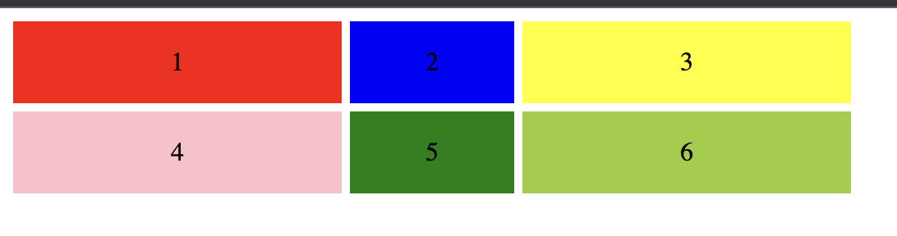

### 一、`grid` 布局是什么

Grid 布局即网格布局，比较擅长将一个页面划分为几个主要区域，我认为它是最强大的 CSS 布局方案，是目前唯一一种 CSS 二维布局。

### 二、`Grid` 布局和 `flex` 布局区别

`flex` 布局是一维布局，`Grid` 布局是二维布局。`flex` 布局一次只能处理一个维度上的元素布局，一行或者一列。`Grid` 布局是将容器划分成了“行”和“列”，产生了一个个的网格，我们可以将网格元素放在与这些行和列相关的位置上，从而达到我们布局的目的。

### 三、学属性

`Grid` 布局属性可以分为两大类，一类是[容器属性](####容器属性)，一类是[项目属性](####项目属性)。

#### 容器属性

1.  `display` 属性
    我们通过在元素上声明 `display：grid` 或 `display：inline-grid` 来创建一个网格容器。声明 `display：grid` 则该容器是一个块级元素，设置成 `display: inline-grid` 则容器元素为行内元素
2.  `grid-template-columns` && `grid-template-columns` 属性
    grid-template-columns 属性设置列宽，grid-template-rows 属性设置行高，这两个属性在 Grid 布局中是很重要的

    - **固定的列宽和行高**

      ```css
      .wrapper {
        display: grid;
        /*  声明了三列，宽度分别为 200px 100px 200px */
        grid-template-columns: 200px 100px 200px;
        /* 行和列间距 5px */
        grid-gap: 5px;
        /*  声明了两行，行高分别为 50px 50px  */
        grid-template-rows: 50px 50px;
      }
      ```

      以上表示固定列宽为 200px 100px 200px，行高为 50px 50px

      

    - **repeat() 函数** : 可以简化重复的值。该函数接受两个参数，第一个参数是重复的次数，第二个参数是所要重复的值。

      ```css
      .wrapper {
        display: grid;
        grid-template-columns: 200px 100px 200px;
        grid-gap: 5px;
        /*  2行，而且行高都为 50px  */
        grid-template-rows: repeat(2, 50px);
      }
      ```

    - **auto-fill 关键字** : 自动填充，让一行（或者一列）中尽可能的容纳更多的单元格。

      ```css
      .wrapper {
        display: grid;
        grid-template-columns: repeat(auto-fill, 200px);
        grid-gap: 5px;
        grid-auto-rows: 50px;
      }
      ```

      

    - **fr 关键字** : fr 单位代表网格容器中可用空间的一等份。`grid-template-columns: 100px 1fr 2fr` 表示第一个列宽为 100px，后面剩余的宽度分为两部分，分别为 1/3 和 2/3。

      ```css
      .wrapper {
        display: grid;
        grid-template-columns: 100px 1fr 2fr;
        grid-gap: 5px;
        grid-auto-rows: 50px;
      }
      ```

      

    - **minmax() 函数** : 该函数调用会产生一个长度范围，接收两个参数，分别为最大值和最小值。`grid-template-columns: 1fr 1fr minmax(300px, 1fr)` 表示第三列款最少是 300px，但最大不能大于前两列宽。

      ```css
      .wrapper {
        display: grid;
        grid-template-columns: 1fr 1fr minmax(300px, 1fr);
        grid-gap: 5px;
        grid-auto-rows: 50px;
      }
      ```

      

    - **auto 关键字** : 由浏览器决定长度。通过 auto 关键字，我们可以轻易实现三列或者两列布局。grid-template-columns: 100px auto 100px 表示第一第三列为 100px，中间由浏览器决定长度。

      ```css
      .wrapper {
        display: grid;
        grid-template-columns: 100px auto 100px;
        grid-gap: 5px;
        grid-auto-rows: 50px;
      }
      ```

      

3.  `grid-row-gap` 属性、 `grid-column-gap` 属性分别设置行间距和列间距。`grid-gap` 属性是两者的简写形式。

    `grid-row-gap: 10px` 表示行间距是 10px，`grid-column-gap: 20px` 表示列间距是 20px。`grid-gap: 10px 20px` 实现的效果是一样的

4.  `grid-auto-flow` 属性，该属性控制着自动布局算法怎么运作，指定如何排列布局元素。默认放置的顺序是‘先行后列’，即先填满第一行，再开始放第二行。也可以将它设成`column`，变成‘先列后行’，代码及效果如下：

  ```css
  .wrapper {
    display: grid;
    grid-template-columns: repeat(3, 100px);
    grid-template-rows: repeat(3, 100px);
    grid-auto-flow: column;
    grid-gap: 5px;
    font-size: 32px;
  }
  ```

  

  `grid-auto-flow`除了能设置`row`和`column`，还可以设成`row dense`和`column dense`，这两个值主要用于 某些项目指定位置后，剩下的项目怎么放置。

  这个例子让前两个盒子各占据两个单元格，在默认 `grid-auto-flow: row` 情况下，会产生下面的布局：

  

  现在修改属性为 `row dense`，表示‘先行后列’，并尽可能紧密填满，尽量不出现空格。效果如下：

  

  如果将设置改为 `column dense`，表示‘先列后行’，并尽可能填满表格。效果如下：

  

5. `grid-auto-columns`属性和 `grid-auto-rows`：用来设置浏览器自动创建的多余网格的列宽和行高。写法和 `grid-template-columns` ，`grid-template-rows`相同。不指定该属性浏览器根据单元格大小自动计算新增网格的列宽和行高。TODO: 案例编写

#### 项目属性
